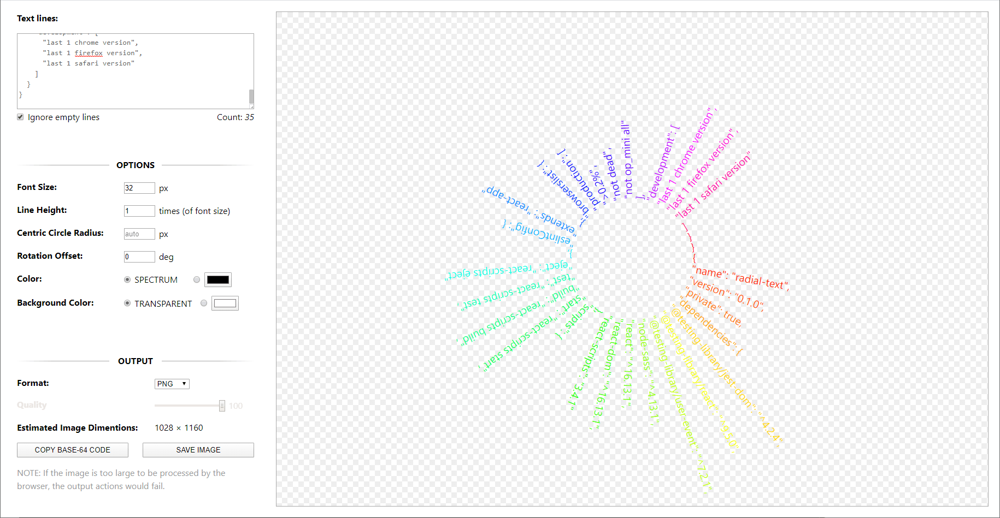
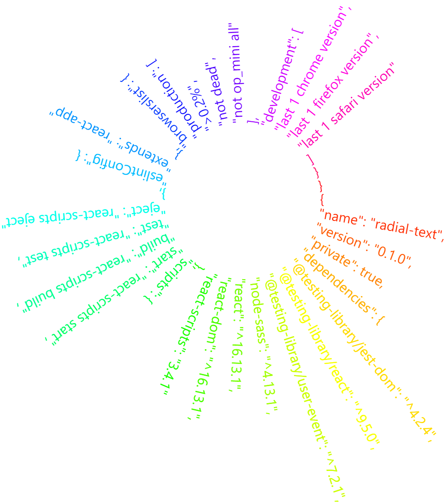

# Radial Text Generator
This is a simple tool for generating radial text rings. You have several options for style adjusting such as font color, font size, background color, etc. It offers a real-time preview of the output and you also can export the text ring to image files later.

The UI:

And the output:

You may have a try here: [Radial Text Generator](https://miscellany.vincent-is.me/radial-text-generator/)

## About The Project
This is a personal practice for React learning and all comments are welcomed.

It uses SVG for real-time rendering and exports images with canvas APIs. The converter is written as a reusable component locates in `src/components/svgToImage`.

## License
Delivered under the [MIT License](../LICENSE).